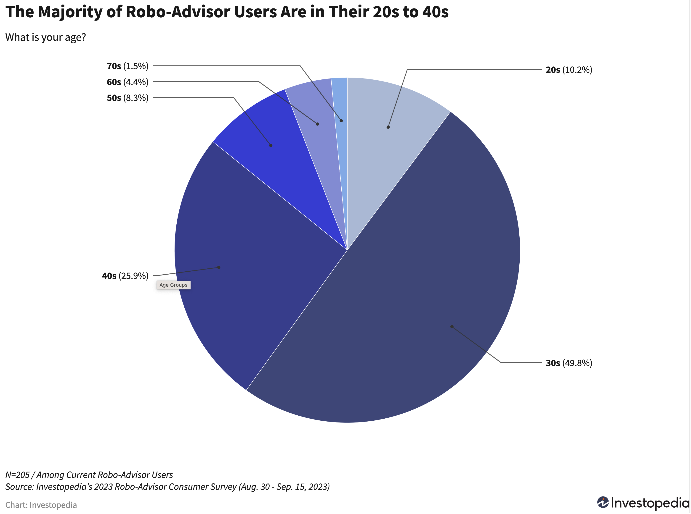
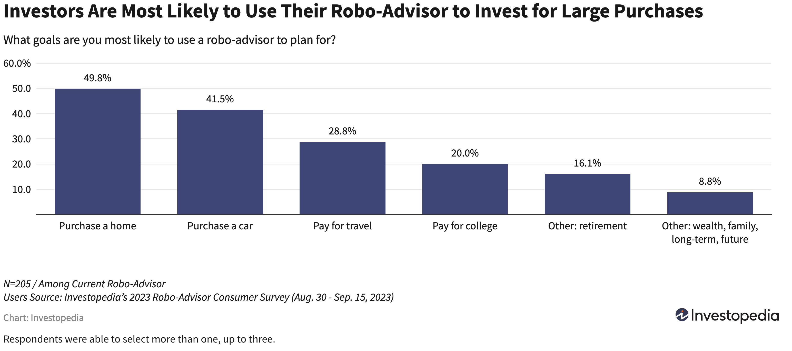
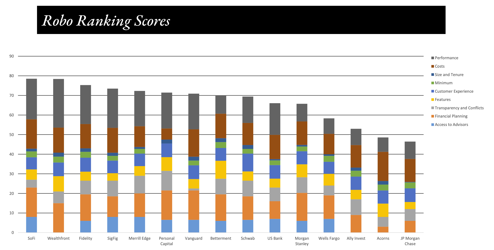

 

written by: Hyun Bin Shin

 

##  Introduction

 

We are currently living in a time when investing our money is more convenient than ever. This has been made possible, in part, by the emergence of a financial domain known as *robo-advisory*. It is a digital platform that can provide financial planning services without the help of human experts through automation and algorithm based decision making process. Traditionally, investment consultation was available only to those who invested large amounts of money and could afford the cost of expert consultation. However, with the advent of robo-advisors, smart investing has become widely accessible to a broader range of people at a much lower cost. One of the leading companies who made all these possible is **Betterment**.

 

##  Overview and Origin

### Overview of Betterment

- Founder: **Jon Stein**
- Co-Founder: **Eli Broverman**
- Founded in: **2008**
- Current CEO: **Sarah Levy**

 

Betterment is a US based robo-advisor company, and it was founded by Jon Stein in 2008. During his college years, the classes he took made him realize how people's decision making processes were not making sense and how irrational people were even though that was not their intentions. This inspired him to develop ideas of helping people make rational decisions. This idea developed further after his graduation. While working at a consulting firm, he realized that many financial companies prioritized their own benefits over their customers' needs. He saw a necessity for better investment information and guidance to customers, and he wanted to make such guidance widely accessible through technology. As a result, with a couple of his friend's help including the co-founder Eli Broverman, he was able to start his own company named Betterment to realize his idea of helping people. After about a year later, he took his company to TechCrunch Disrupt, which is a conference where companies can showcase their products, and Jon was able to successfully attract people's attention. About a month after the conference, their assets under management (AUM) grew to $1 million. Today, Betterment is backed by 27 investors across 10 funding rounds. Their most recent round of funding raised about $160 million which was comprised of Series F equity of $60 million and $100 million credit facility. This raise was able to push the company's market value to about $1.3 billion. 

##  Business activities

 

Betterment offers automated investment services using their proprietary technology and human expertise. Their user-friendly website and mobile applications, coupled with an algorithm-driven portfolio construction automation, assist customers to achieve their financial goals. Upon signing up, customers complete a questionnaire about their financial goals and select their preferred portfolio from a range of diversified options offered by the company. The program then automatically chooses stocks and ETFs to construct a customized portfolio based on the customer's needs. Additionally, Betterment provides features such as auto-rebalancing and tax-loss harvesting for effective portfolio management. These automated service utilizes techniques called 'Monte Carlo simulation' and 'Black-Litterman model' according to Mychal Campose, who is the chairman of investing at Betterment. This is interesting because when a lot of other robo-advisor companies are trying to use machine learning and/or AI for automation, Betterment focused on more classic techniques for their portfolio construction. Betterment chose this way because they believe these techniques provide superior performance. Nonetheless, Campos notes that Betterment still employs machine learning to calculate expected returns or risks of funds and to construct cryptocurrency-based portfolios.

Betterment's primary target audience includes all individuals aiming to achieve their financial goals, such as those planning big purchases or planning for retirement. To understand the characteristics of the target audience, Investopedia conducted a survey to Betterment's users. The survey revealed that the majority were in their 30s and 40s. This finding is logical, as people in these age groups are commonly associated with major purchases, such as buying a house or a car.

 

##### **images exerpt from https://www.investopedia.com/betterment-review-4587887**

 

Additionally, Betterment offers a $0 account minimum and requires only $10 to start investing, making it accessible for investors with limited initial capital. This effectively lowers the entry barrier to small investors. Furthermore, the company also offers access to checking account and a high-yield cash reserve account through their partnered banks, along with an automatic sweep function that automatically transfers money from a checking account to an investment account with higher interest potential at the end of each business day. In summary, Betterment's strengths lie in its ease of investment with minimal initial funds, user-friendly experience, and additional cash management features. These attributes make Betterment to stand out from its competitors, particularly attracting beginners in investment.

 

##  Landscape

 

Betterment is in the domain of robo-advisor and personal finance. Some other well-known major companies in this domain are SoFi Automated investing, Wealthfront, and Vanguard personal advisor services. In the field of robo-advisor, the emergence and integration of AI and machine learning has been great innovation in the past 5 - 10 years. These technologies made it possible to automate the portfolio construction without much intervention of human expertise, so this made higher quality financial advices much more accessible to the general public. Also, the world-wide provision of mobile phones became key innovation for robo-advisor field as well. With the mobile phone, now people are able to access their financial accounts anytime, anywhere they want.

 

##  Results

 

According to the Betterment website, as of August 30, 2023, they manage over $40 billion in assets under management (AUM) and report having more than 800,000 clients. AUM and client numbers would be some of the core metrics used in the industry to gauge a company's success. Based on an article from Forbes, Betterment is ranked 3rd in terms of their AUM and client numbers (the numbers provided by Forbes were different than Betterment website, possibly due to the point of time when they performed the measurement). Additional important metrics include advisory fees (cost), access to human experts, financial planning capabilities, performance level, customer satisfaction, and the number of features provided by the company. These metrics are evaluated in The Robo Report, a publication by Condor Capital that analyzes the robo-advisor industry. According to their report for the second quarter of 2022, Betterment ranked 8th out of 15 companies in overall performance. Specifically, for portfolio performance, Betterment was ranked 10th out of the 15 companies compared. 

 

#### (This bar chart shows the rankings of robo-advisor companies based on Robo Ranking Scores in the second quarter of 2022)

##### image exerpt from https://storage.googleapis.com/gcs.backendb.com/wordpress/media/2023/03/2Q22-Robo-Report-and-Summer-2022-Robo-Ranking.pdf

 

Nevertheless, Betterment's strengths lie in its user experience and ease of access. Consequently, The Robo Report in the second quarter of 2022, Forbes in 2023, and Investopedia in 2023 all chose Betterment as the top choice for investment beginners.

 

##  Recommendations

 

For improvement of their service, I would suggest that the company build a chatbot to function as a financial advisor for their customers. The company has significantly lowered the entry barrier for many people, making it easy for anyone to start investing. However, these new investors often desire to understand where their money is being invested and may have desire to customize their portfolio based on their specific areas of interest. Additionally, many of them may not even have extensive financial knowledge to begin with. In such cases, a chatbot could effectively address these concerns. By conversing with customers, the chatbot can identify specific fields or areas of interest for investment and customize the portfolio accordingly if applicable. It can also explain the rationale and methodology behind portfolio construction and answer any questions the customers might have. The chatbot may even provide brief education to their customers on investment. By doing this, the company can offer more personalized portfolios and improve customer satisfaction. In the future when the service becomes stable, the company would expect to lower cost since they would need less customer service agents or human experts to answer their customer's questions or concerns. In order to implement this, I believe employing a Large Language Model (LLM) would be an ideal technology for this service. An LLM can facilitate very human-like conversations with customers and provide appropriate responses to their questions.

 

###  Addendum:

##### - Article about Betterment's technology: https://www.emergingtechbrew.com/stories/2022/10/11/why-betterment-s-robo-advisor-doesn-t-use-ai
##### - Betterment website: https://www.betterment.com/
##### - Betterment funding rounds and investors info: https://www.crunchbase.com/organization/betterment/company_financials
##### - Bloomberg article about Betterment fundraise: https://www.bnnbloomberg.ca/betterment-valuation-rises-to-1-3-billion-on-funding-round-1.1659171
##### - Forbes comparison of robo-advisor companies by AUM: https://www.forbes.com/advisor/investing/top-robo-advisors-by-aum/
##### - Forbes interview with Jon Stein: https://www.forbes.com/sites/brucerogers/2018/01/18/jonathan-stein-built-betterment-to-help-investors-make-better-decisions/?sh=69e27c924d30
##### - History of robo-advisor: https://www.linkedin.com/pulse/robo-advisor-origin-story-you-must-read-part-1-ken-shih/
##### - Investopedia review of Betterment: https://www.investopedia.com/betterment-review-4587887
##### - Investopedia comparison of robo-advisors: https://www.investopedia.com/best-robo-advisors-4693125
##### - Investopedia robo-advisor: https://www.investopedia.com/terms/r/roboadvisor-roboadviser.asp
##### - Robo report archives: https://www.condorcapital.com/the-robo-report/report-archives/
##### - Robo report second quarter 2022: https://storage.googleapis.com/gcs.backendb.com/wordpress/media/2023/03/2Q22-Robo-Report-and-Summer-2022-Robo-Ranking.pdf
##### - Robo report the rise of digital advice: https://storage.googleapis.com/gcs.backendb.com/1/2020/11/The-Rise-of-Digital-Advice.pdf

