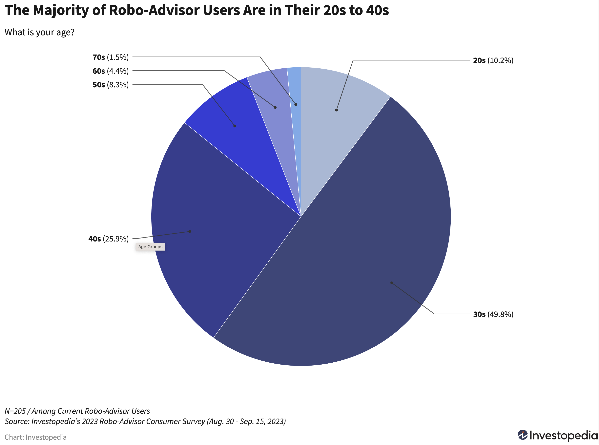
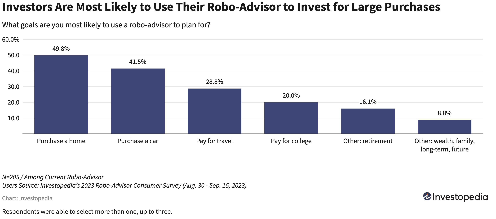
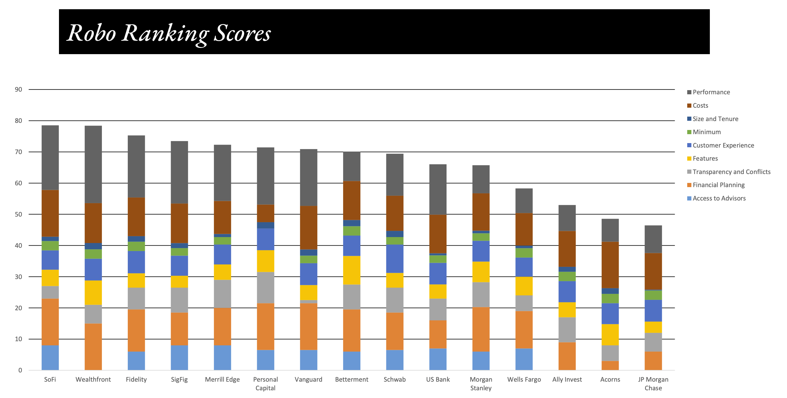

 

written by: Hyun Bin Shin
 
 

##  Introduction

 

We are currently living in the time where it is convenient to invest our money more than ever. One reason how this became possible is with the emergence of the financial domain called 'robo advisory.' It is a digital platform that can provide financial services planning without the help of human experts through automation and algorithm based decision making process. Traditionally, investment consultation was only for the people who invests large amount of money who could afford the cost of consultation with the expert, but with the help of robo advisor, smart investing becaome widely accessible to wide range of people with much lower cost. One of the leading company that made this possible is **Betterment**.

 

##  Overview and Origin

### Overview of Betterment

- Founder: **Jon Stein**
- Co-Founder: **Eli Broverman**
- Founded in: **2008**
- Current CEO: **Sarah Levy**

 

Betterment is a US robo advisor company, and it was founded by Jon Stein in 2008. In his earlier college years, the classes he took taught him how people's decision making process does not make sense and how irrational people are even though that was not intended. He started to develop the idea to make the world better by helping people make rational decisions. After his school, his idea has developed further. While he was working for a consulting company, he learned that many financial companies do not think about their customers, but just try to maximize their benefits. He felt like people need to be provided with better information to invest and people need better guidance to make better decisions for their investment. He also wanted to make that guidance accessible to many people with the help of technologies. As a result, with a couple of his friend's help including the co-founder Eli Broverman, he was able to start his own company named Betterment. After about a year later, he took his company to TechCrunch Disrupt, which is a conference where companies can showcase their products, and Jon was able to successfully attract people's attention. After about a month after the conference, their assets under management (AUM) grew to $1 million. Nowadays, Betterment is funded by 27 investors with 10 rounds of fundings. Their most recent round of funding raised about $160 million which was comprised of Series F equity of $60 million and $100 million credit facility. This raise was abel to push the company's market value to about $1.3 billion. 

##  Business activities

 

Betterment provides automated investment by using their own technology and human experts. Using their user-friendly websites and mobile applications and algorithm driven portfolio construction, the company helps their customers reach their financial goals. Once a customer signs up, they go through a short questionnaires about their financial goals, and the program automatically constructs their portfolios based on their own financial goals. The program provides multiple different portfolios based on different goals, and it also provides features like auto-rebalancing portfolio, tax-loss harvesting. Their main target audience are all the people who needs to reach their financial goals. In detail, Investopedia's survey revealed that the majority of their users are in their 30s and 40s; which makes sense since those age groups are commonly associated with meeting specific financial goals since they usually require big purchases like buying a house or a car. 

 

##### **images exerpt from https://www.investopedia.com/betterment-review-4587887**

 

The company offers $0 account minimum and only $10 to start investing, which makes it easy and accessible to the investors who does not have a lot of money to invest at first. This lowers the entry barrier to small investors. Compared to its competitors, the company also offers automatic sweep functionality and offers acces to checking account and a high-yield cash reserve account through their partnered banks. In summary, the company's competitively low advisory fees, user-friendly experience, and other cash management features because their strong points compared to their competitors, and was able to attract many people, specially who are beginners to investment. 

 

##  Landscape

 

Betterment is in the domain of robo-advisor and personal finance. Some other well-known major companies in this domain are SoFi Automated investing, Wealthfront, and Vanguard personal advisor services. In the field of robo-advisor, the emergence and integration of AI and machine learning has been great innovation for the past 5 - 10 years. These technologies made it possible to automate the portfolio construction without much intervention of human experts, so this made higher quality financial advices much more accessible to the general public. Also, the world-wide provision of mobile phones became key innovation for robo-advisor field as well. With the mobile phone, now people are able to access their financial accounts anytime, anywhere they want.

 

##  Results

 

According to the Betterment website, they have $40+ billion of assets under management (AUM) as of Aug 30, 2023 and their reported customer count is 800,000+. These would be some of the core metrics that are used in the industry to measure a company's success. Furthermore, some other metrics to consider would include cost (advisory fees), ability to access human experts, financial planning abilities and its performance leve, customer satistaction, and number of features the company provides. These metrics are used in The Robo Report, which is a report created by Condor Capital who publishes reports about robo-advidor industry. According to their report, in the second quarter of 2022, Bettermant overall ranked 8 out of 15 companies that the report compared against. In terms of their performance of the portfolio, Betterment ranked 10 out of 15. 

 

#### (This bar chart shows the rankings of robo-advisor companies based on Robo Ranking Scores in the second quarter of 2022)

##### image exerpt from https://storage.googleapis.com/gcs.backendb.com/wordpress/media/2023/03/2Q22-Robo-Report-and-Summer-2022-Robo-Ranking.pdf

 

However, Betterment's strength is in its user experience and ease of accessing its service, so the Robo report in the second quarter of 2022, Forbes in 2023, and Investopedia in 2023 all chose Betterment as the best company for the beginners. 

 

##  Recommendations

 

I would suggest the company to build a chat bot that can function as their customer's financial advisor. The company has lowered the entry barrier to a lot of people which makes it easy for anyone to start investing their money, but they would also like to know where they are investing and they would also have specific areas where they want to invest in. Moreover, a lot of those people may not have much of financial knowledge to understand investing to begin with. 
In these cases, I think the chat bot would be able to address all these issues. By having conversation with their customers, the chat bot can recognize specific fields or areas where their customers want to invest into and it can re-construct the portfolio accordingly. Also, the chat bot could also explain to their customers why and how their portfolio is constructed, and it could also answer any questions that thier customers may have. By doing these, the company can provide more personalized portfolios and also have better customer satisfactions.
Large Language Model (LLM) would be a good technology to apply in this case to launch the suggested service. LLM will be able to have very human-like conversation with their customers, and it would also be able to provide appropriate answers to the questions that their customers may be asking. 

 

###  Addendum:

##### - Betterment website: https://www.betterment.com/
##### - Investopedia review of Betterment: https://www.investopedia.com/betterment-review-4587887
##### - Forbes interview with Jon Stein: https://www.forbes.com/sites/brucerogers/2018/01/18/jonathan-stein-built-betterment-to-help-investors-make-better-decisions/?sh=69e27c924d30
##### - Article about Betterment's technology: https://www.emergingtechbrew.com/stories/2022/10/11/why-betterment-s-robo-advisor-doesn-t-use-ai
##### - History of robo-advisor: https://www.linkedin.com/pulse/robo-advisor-origin-story-you-must-read-part-1-ken-shih/
##### - Bloomberg article about Betterment fundraise: https://www.bnnbloomberg.ca/betterment-valuation-rises-to-1-3-billion-on-funding-round-1.1659171
##### - Betterment funding rounds and investors info: https://www.crunchbase.com/organization/betterment/company_financials
##### - Investopedia comparison of robo-advisors: https://www.investopedia.com/best-robo-advisors-4693125
##### - Investopedia robo-advisor: https://www.investopedia.com/terms/r/roboadvisor-roboadviser.asp
##### - Robo report archives: https://www.condorcapital.com/the-robo-report/report-archives/
##### - Robo report second quarter 2022: https://storage.googleapis.com/gcs.backendb.com/wordpress/media/2023/03/2Q22-Robo-Report-and-Summer-2022-Robo-Ranking.pdf
##### - Robo report the rise of digital advice: https://storage.googleapis.com/gcs.backendb.com/1/2020/11/The-Rise-of-Digital-Advice.pdf

